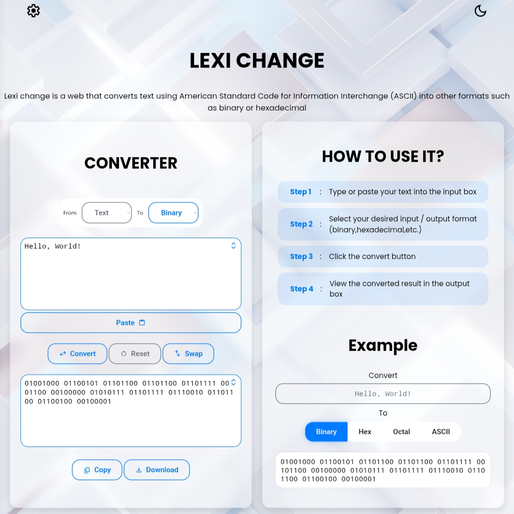

# 📝 Lexi Change

**ZPP** (Zikri Practice Project) Series **IV**

[](https://zikri-codes.github.io/Lexi-Change-ZPP-IV/) 


[](https://github.com/zikri-codes/Lexi-Change-ZPP-IV/blob/main/LICENSE)


## 📌 Description
A simple web-based **text converter** built with HTML, CSS, and JavaScript.  
Users can **convert text** between different formats or manipulate strings easily through the web.

## ✨ Features
- **Text transformations**:  
  - Binary
  - Hexadecimal
  - Octal
  - ASCII (numeric)
- **Simple and clean UI**.

## 📸 Screenshot

 

## 📁 Project Structure

```
. ├── README.md                 # Project description 
  ├── LICENSE                   # Polyform NC License 
  ├── notes.txt                 # Some trash stuff yk
  ├── index.html                # Main HTML file 
  ├── style.css                 # Styling 
  ├── script.js                 # JS logic 
  ├── background-dark-1757.png  # Dark background web
  ├── background-1757.png       # Background web
  └── screenshot.png            # Main content screenshot
```

## 📄 License

This project is licensed under the **PolyForm Noncommercial License 1.0.0** - see the [LICENSE](https://github.com/zikri-codes/Lexi-Change-ZPP-IV/blob/main/LICENSE) file for details.
